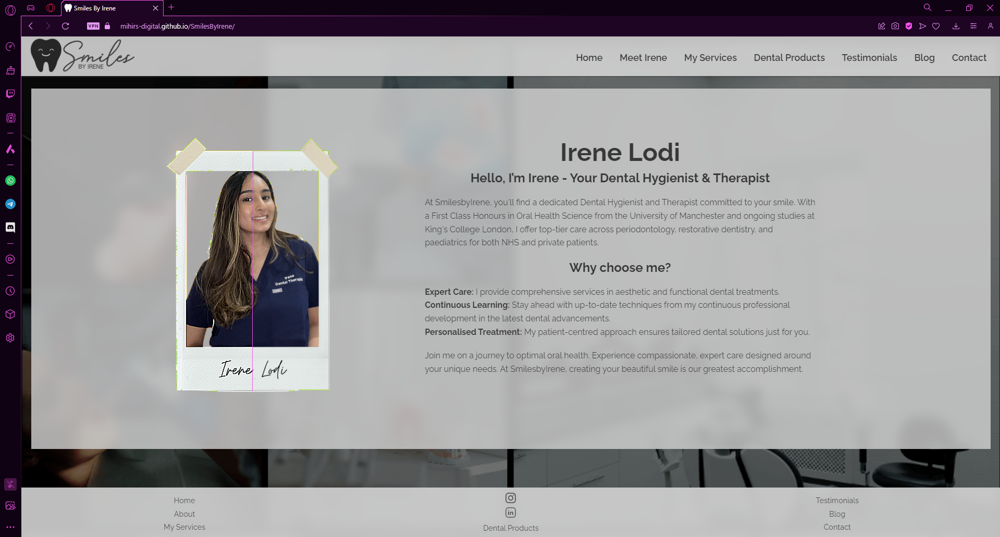

# Smiles By Irene

Welcome to the official website of "Smiles By Irene," a dedicated platform for dental hygiene and therapy for Irene Lodi, Dental Hygienist & Therapist. This site is crafted to serve a diverse audience including patients, dental professionals, and dental students, providing a comprehensive look into Irene's practice and the broader field of dental care.

## Introduction

The "Smiles By Irene" website is designed to be a central hub for engaging with the services offered by Irene Lodi, a seasoned Dental Hygienist and Therapist. It provides valuable information on various dental procedures, access to recommended dental products, and direct communication with Irene through an enquiry form.

The website respects a responsive design, accomodating for all standard display sizes from mobiles, tablets, laptop and desktops.

## Website Structure

The website consists of several key pages:

- **Home Page (`index.html`)**: The starting point of the website, introducing visitors to the site. See screenshot: 
- **Meet Irene (`meetirene.html`)**: Detailed background on Irene Lodi, her qualifications, experience, and professional goals. 
- **My Services (`services.html`)**: Information on services provided, ranging from Gum Disease Treatment to Dental Restorations & Airflow, coupled with educational content about these procedures. 
- **Dental Products (`dentalproduct.html`)**: A curated selection of dental products recommended by Irene, featuring links to purchase these items through Amazon wish lists.
- **Testimonials (`testimonials.html`)**: Reviews and experiences shared by patients.
- **Blog (`blog.html`)**: Currently under construction, this section will feature articles and updates from Irene. 
- **Contact (`contact.html`)**: Contains a form for direct enquiries and links to Irene's social media profiles on Instagram and LinkedIn. 

## Features

### Existing Features

__Navigation Bar__

Heavily inpired by the Love Running walkthrough, the navigation bar is featured on all pages and with responsive design. It is consistent throughout the whole website. 

For example, on the Galaxy S20 Ultra, the home page would look like this unexpanded: 

Expanded would look like this:

On the iPad Pro:

On a laptop/desktop:.

__Footer__

 The footer also follows responsive design but does not contain an expanded section.

 Desktop:
 

 Mobile: 

## Design

The website sports a modern iOS-inspired aesthetic with silver and grey tones. It features:
- A collage of background images sourced from Pexels.
- A consistent use of an RGBA colour scheme (211, 211, 211, 0.900) for most sections, adding a blur effect with `backdrop-filter: blur(10px);`.
- Dark grey text (`color: rgba(56, 56, 56, 1)`) across the website, with white text in the testimonials section to enhance readability.

Initial sketches were created using Samsung Notes to conceptualise the layout and interface of the website.

## User Experience

Visitors to the website are guided through a seamless journey where they can learn about Irene Lodi, explore the services offered, view recommended dental products, read testimonials from other patients, and make enquiries directly through the contact page.

## Technologies Used

- **DALL-E 3**: Used to generate the initial tooth image for the Smiles by Irene logo.
- **Paint.net & PowerPoint**: Tools for extensive editing of the logo and other images.
- **Canva**: Used to create visual content for the `meetirene.html` page.
- **Visual Studio Code with Live Server**: Enabled real-time testing and viewing of the website during development.

## Deployment

The website is hosted on GitHub Pages and can be accessed through the following URL: [Smiles By Irene](https://mihirs-digital.github.io/SmilesByIrene/). For local deployment, ensure all files are downloaded and relative paths are maintained to preserve the site's structure and functionality.

## Future Enhancements

The blog section is in development, intended to provide additional insights and updates from Irene's practice. Further expansion and functionality enhancements are planned to keep the website up-to-date with the latest in dental care and patient services.

## Browser Testing 

__Chrome__
The Website works without issues on Chrome:

__OperaGX__
The Website works without issues on Opera/OperaGX:

__Firefox__
The Website works without issues on Firefox:

__Safari__
The Website works without issues except for a lack for blur throughout the website: 

## Validation Tesing

__HTML__
No errors were found when using the Nu HTML Checker Service: 

__CSS__
No errors were found when using the W3C CSS Validation Service: 

## Credits

- Special thanks to Mentor Sheryl S. Goldberg for the detailed last minute feedback. 
- All images in this project has been taken by myself, given by Irene (the dental practioner), created using AI, and edited using paint.net, PowerPoint and Canva.
- All text content was typed by myself or generated by AI.
- The background image is a collage of images downloade form pexels.com.
- The icon for the Navigation menu was taken from fontawesome.
- The social media icons present are linked http://www.w3.org/2000/svg.
- Free material from https://www.w3schools.com/ has been used extensively for CSS guidance.

